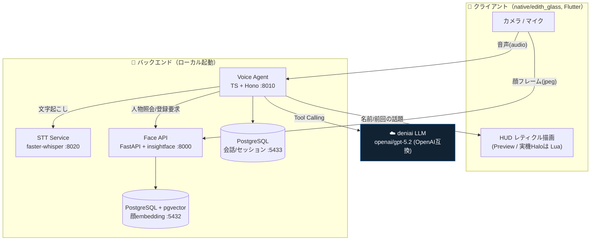
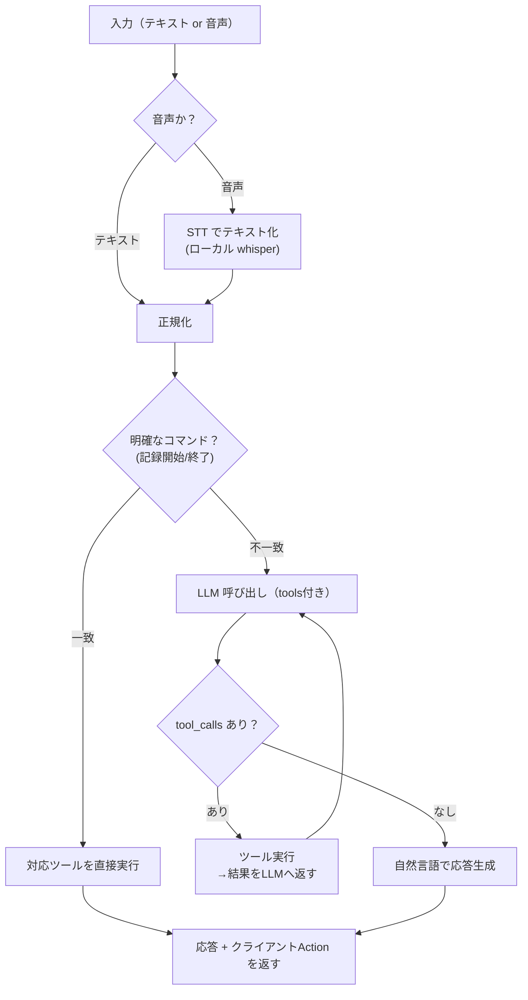
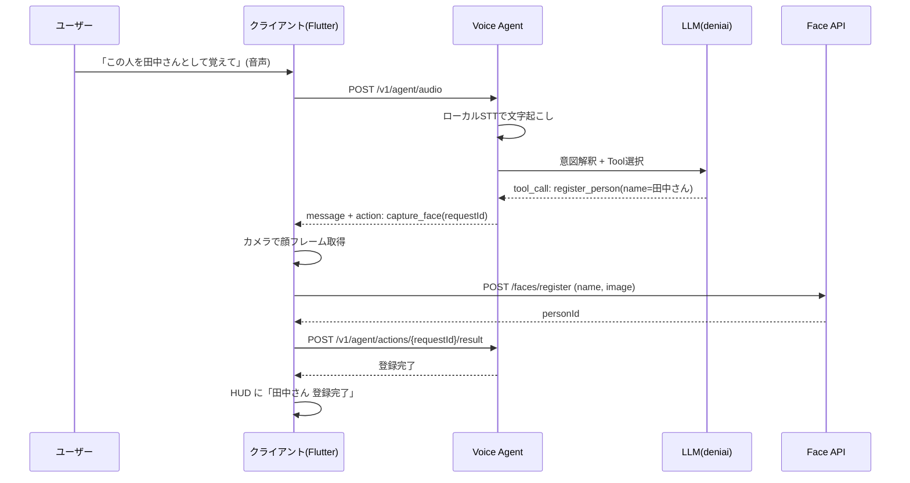
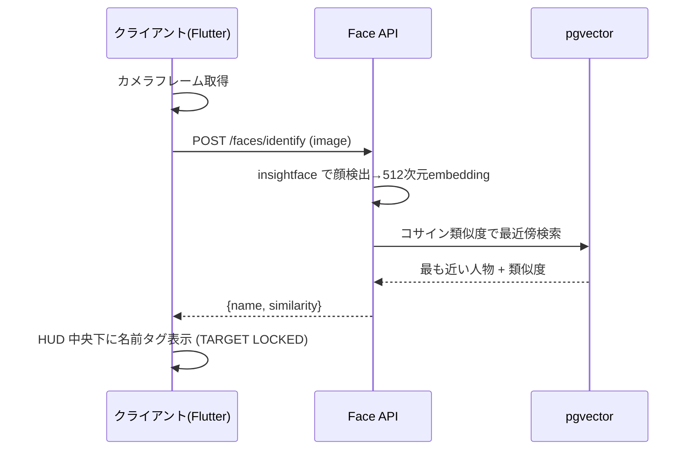
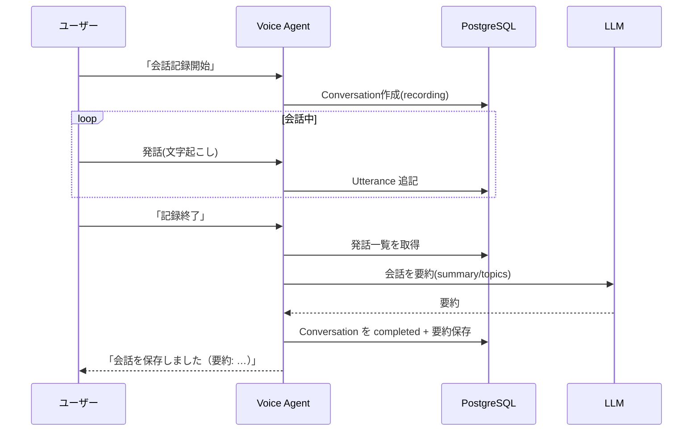
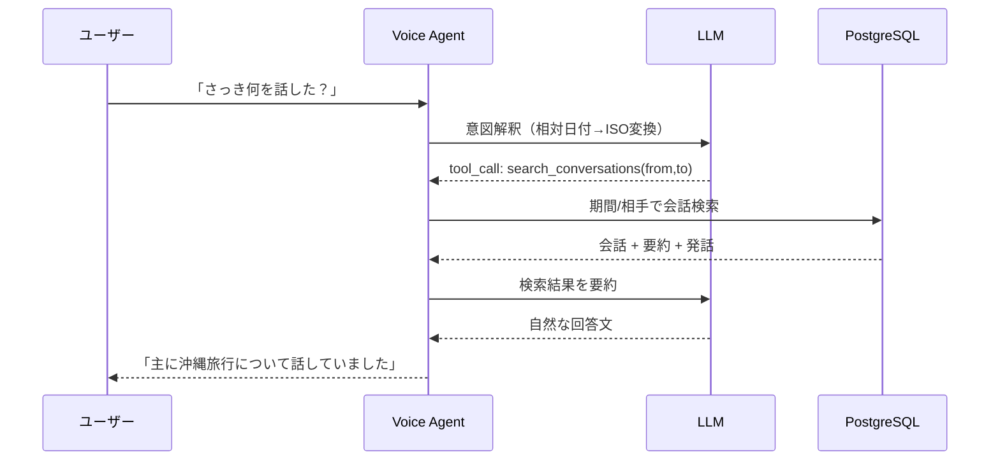
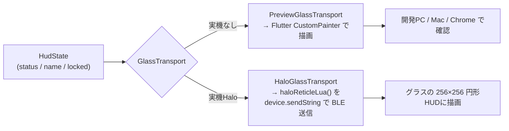

# E.D.I.T.H アーキテクチャ解説（プレゼン資料用）

> スマートグラス(brilliant.xyz **Halo**)向け「社会的記憶」補助システム。
> 一度会った人を **Recognize（誰か分かる）→ Remember（何を話したか思い出す）→ Assist（今の会話を助ける）**。
> このドキュメントはプレゼン資料作成のベース。図は Mermaid でそのまま貼り付け・編集できます。

---

## 1. 何を解決するか（1枚要約）

- 顔は覚えていても **名前・所属・前回の話題** が出てこない、という対面コミュニケーションの負荷を、AI が視界上で補助する。
- グラスは薄い「表示・センシング端末」に徹し、**知能はバックエンドのマイクロサービス**に置く（＝実機が無くても先行開発できる）。
- 当面の目標は **Lv.1：顔認識 → 名前を HUD 表示**。

---

## 2. システム全体像

4つの独立サービスで構成。各サービスは疎結合（HTTP/JSON）で、クライアントを Mac→スマホ→Halo と差し替えても中身は不変。

**設計の要点**
- **Agent とデバイスの分離**: Agent はカメラ等を直接触らず、`capture_face` などの *Action* をクライアントへ返す。
- **記憶はDB、LLMは変換器**: 人物・会話は PostgreSQL に保存し、必要分だけ LLM に渡す（Context Window を永続化に使わない）。
- **ローカル優先**: LLM のみクラウド(deniai)、**文字起こし(STT)はローカル**。顔認識も完全ローカル。

---

## 3. 技術スタック

| サービス | 役割 | 技術 | ポート |
| --- | --- | --- | --- |
| **Voice Agent** | 指示理解・Tool Calling・会話ログ・記憶 | TypeScript / Hono / Drizzle / PostgreSQL | 8010 |
| **STT Service** | 音声の文字起こし（ローカル） | Python / faster-whisper (CPU int8) | 8020 |
| **Face API** | 顔の登録・識別（Embedding） | Python / FastAPI / insightface(buffalo_l, 512次元) / pgvector | 8000 |
| **Native Client** | グラスHUD・カメラ・音声 | Flutter / (Halo: brilliant_sdk, Lua) | — |
| **LLM** | 意図理解・Tool選択・応答生成 | deniai `openai/gpt-5.2`（OpenAI互換, クラウド） | — |

---

## 4. Agent の処理パイプライン

明確なコマンド（「会話記録開始」等）は **LLMを介さず**決定的に処理（低レイテンシ・低コスト）。それ以外は **LLM の Tool Calling ループ**へ。

**MVPツール**: `register_person` / `get_person` / `start_conversation` / `stop_conversation` / `search_conversations`

---

## 5. 主要フロー（シーケンス図）

### 5-1. 人物登録（音声 →「この人を田中さんとして覚えて」）

Agent は顔登録を自分でせず、クライアントに撮影を要求する（デバイス分離）。

### 5-2. 顔識別 → HUD に名前タグ（Lv.1 のコア）

### 5-3. 会話ログ → 終了時に自動要約

### 5-4. 過去会話検索

---

## 6. HUD とデバイス非依存（Native の肝）

「グラス越しの映像」= 256×256 の円形ディスプレイ（Halo と同解像度）に **SFレティクル** を中央表示。
同じ状態(`HudState`)から、**Flutter描画（実機なしのプレビュー）** と **Halo実機用のLua描画** を生成する。

- レティクル幾何は `hud_geometry.dart` に一元化 → プレビューと実機の見た目が一致。
- 実機到着前は **halo-ws-simulator**（公式）で `sendLua` を実機同様に検証でき、到着後は依存差し替えのみ。

---

## 7. 現状と今後

**実装・検証済み**
- ✅ Face API：顔の登録・識別（近距離の大きな顔の検出不具合を修正済み）
- ✅ Voice Agent：Text指示 + 音声入力(Push-to-Talk)、Tool Calling、会話ログ・要約・検索
- ✅ STT：ローカル文字起こし（日本語）
- ✅ Native：SFレティクルHUD、バックエンド実通信、Preview/実機トランスポート抽象

**今後（ロードマップ）**
- クライアントの実カメラ連続識別（現在は同梱画像で代替）
- HUD 表示レベル制御（Lv.2 前回の話題 / Lv.3 詳細・会話cue）
- Phase 3：会話ログ自動化（VAD + 連続STT + 話者分離）
- Phase 4：WebSocket リアルタイム化、TTS（音声応答）
- Phase 5：Halo 実機統合（brilliant_sdk / BLE / RxPhoto・RxAudio）

---

## 8. テスト方法

| 対象 | 方法 |
| --- | --- |
| バックエンド | `podman` で PostgreSQL(+pgvector) 起動 → 各サービス起動（README参照） |
| Native(Mac) | `flutter run -d macos`（localhost 直結）または `-d chrome` |
| Native(iPhone) | `flutter create --platforms=ios .` → Xcode署名 → `api_config.dart` を Mac の LAN IP に変更 → `flutter run -d <iPhone>` |
| レティクル描画 | `flutter test --update-goldens` で実描画PNGを生成 |
| バックエンド結合 | `dart run tool/smoke.dart`（稼働中サービスへ実通信） |

> 注: iPhone 実機で「ライブカメラ識別」「Halo HUD描画」を行うには、実カメラ配線 / Halo実機(BLE) が別途必要。
