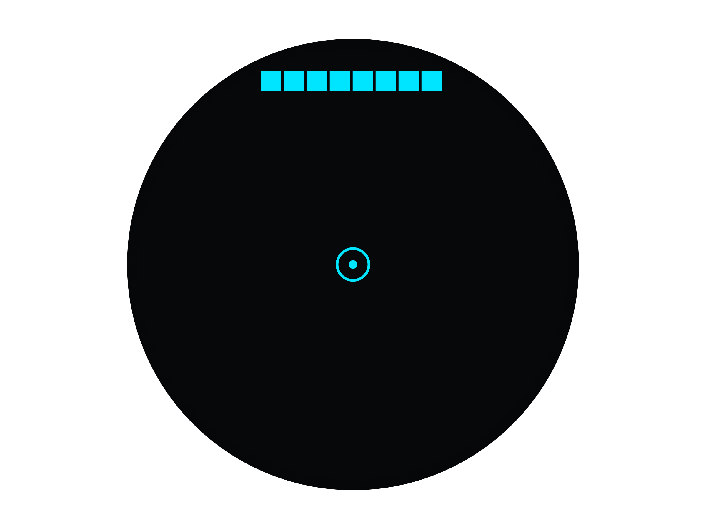

# E.D.I.T.H Glass Client (Flutter / Halo)

brilliant.xyz **Halo** スマートグラス用のホストクライアント（Flutter）。
グラスの HUD に **SF風レティクル（照準）** を中心表示し、カメラ映像を Face API で識別して
名前タグを出し、音声/テキスト指示を Voice Agent に流す。

> **実機なしで開発・デバッグ可能**。Halo 到着前は Flutter 描画（`PreviewGlassTransport`）が
> そのままグラス映像のプレビューになり、到着後は `HaloGlassTransport` に差し替えるだけ
> （HUD 描画は同じ幾何を Halo Lua 化して BLE で送る）。



## 何が動くか

- **HUD レティクル**: 256×256 円形ディスプレイ（Halo と同解像度）に、外周目盛りリング・
  コーナーブラケット・中央クロスヘア・照準リングを描画。認識時は緑＋ロックアーク演出。
  - Flutter 描画: `lib/hud/reticle_painter.dart`
  - 実機 Halo 用の同一幾何 Lua: `lib/hud/halo_reticle_lua.dart`（`frame.display.*`）
- **カメラ**: 実カメラ対応（`camera` パッケージ）。**iPhone / Web(Chrome の getUserMedia)** でライブ映像を
  HUD 背景に表示し、撮影フレームを識別・登録に使う。カメラ非対応環境（macOSデスクトップ等）は
  同梱画像 `assets/sample_face.jpg` に自動フォールバック（`lib/camera/frame_source.dart`）。
- **顔追従トラッキング**: ライブ時、`/v1/vision/detect`（Face API `/faces/detect` 中継）を ~700ms でポーリングし、
  検出した顔にコーナーブラケット枠を **lerp 補間で滑らかに追従**表示（`FaceBoxPainter`）。前面カメラの
  左右反転に合わせる **ミラートグル**付き（枠が顔とズレたら切替）。レティクルは中央のドットサイトのみ。
- **識別**: 自動（顔検出中に定期）／手動「今すぐ識別」→ HUD に名前タグ＋一致度。
- **指示**: テキストを Voice Agent `/v1/agent/input` へ。`capture_face` アクションが来たら
  カメラ撮影→登録を実行し、結果を Agent に返す。
- **音声**: `VoiceAgentApi.sendAudio()` で `/v1/agent/audio`（サーバ側ローカルSTT）に対応。

> 顔の識別/登録は **Voice Agent の vision プロキシ(`/v1/vision/identify` · `/v1/vision/register`)経由**で
> Face API に中継する（ブラウザCORS回避＋単一オリジン）。実機では `RxPhoto`（JPEG）フレームを
> `FrameSource` に差し込む。

## アーキテクチャ（デバイス非依存）

```
UI / ロジック
   │  render(HudState)                identify() / sendText()
   ▼                                    ▼
GlassTransport (抽象)              VoiceAgentApi / FaceApi (http)
   ├─ PreviewGlassTransport → Flutter で GlassView に描画（実機なし）
   └─ HaloGlassTransport   → haloReticleLua(state) を device.sendString で BLE 送信（実機）
```

同じ `HudState` が Preview と実機の両方を駆動する。`GlassTransport` を差し替えるだけで
Mac/Web → スマホ → Halo へクライアントを移せる。

## 実行

```bash
flutter pub get

# 実カメラで試すなら Chrome 推奨（Webカメラ＋コード署名不要）。要 Voice Agent(:8010) 起動。
flutter run -d chrome

# iPhone（実機カメラ）: iOS を生成して署名してから
flutter create --platforms=ios .   # 初回のみ。ios/Runner/Info.plist に NSCameraUsageDescription を追加
flutter run -d <iPhone>            # api_config.dart の localhost を Mac の LAN IP に変更

# macOS デスクトップ（カメラは非対応→サンプル画像に fallback）
flutter run -d macos
```

**メモ**
- Web からバックエンドを叩くための CORS は Voice Agent 側で許可済み。顔の識別/登録も
  Agent の vision プロキシ経由なので、クライアントは Agent(:8010) 単一オリジンでよい。
- **macOS ビルドで `CodeSign failed ... resource fork ... not allowed` が出る場合**:
  ダウンロード等で付いた拡張属性 `com.apple.provenance` が原因。`xattr -cr .` 後に
  `flutter clean && flutter run -d macos`。消えない環境では `-d chrome` を使うのが確実。

## 開発ツール（実機なしでの検証）

- **解析**: `flutter analyze`
- **テスト**: `flutter test`（レティクルの golden 描画 + Halo Lua 生成の単体テスト）
  - レティクルの実描画を更新: `flutter test --update-goldens` → `test/goldens/*.png`
- **バックエンド結合スモーク**（3サービス起動が前提）: `dart run tool/smoke.dart`
- **実機シミュレータ**: brilliant 公式の `halo-ws-simulator` を使うと、`HaloGlassTransport` の
  `sendLua` を実機同様に WebSocket 経由で流して HUD 描画を確認できる（依存差し替えのみで実機へ）。

## Halo 実機への配線（到着後）

`pubspec.yaml` に `brilliant_ble` / `brilliant_msg`（または `brilliant_sdk`）を追加し、
`main.dart` の transport を差し替える:

```dart
final device = await BrilliantBluetooth.connect(scanned);
final transport = HaloGlassTransport(sendLua: (lua) async {
  await device.sendBreakSignal();
  await device.sendString(lua, awaitResponse: false);
});
// カメラは device の RxPhoto、マイクは RxAudio を購読して FaceApi/VoiceAgentApi へ。
```
